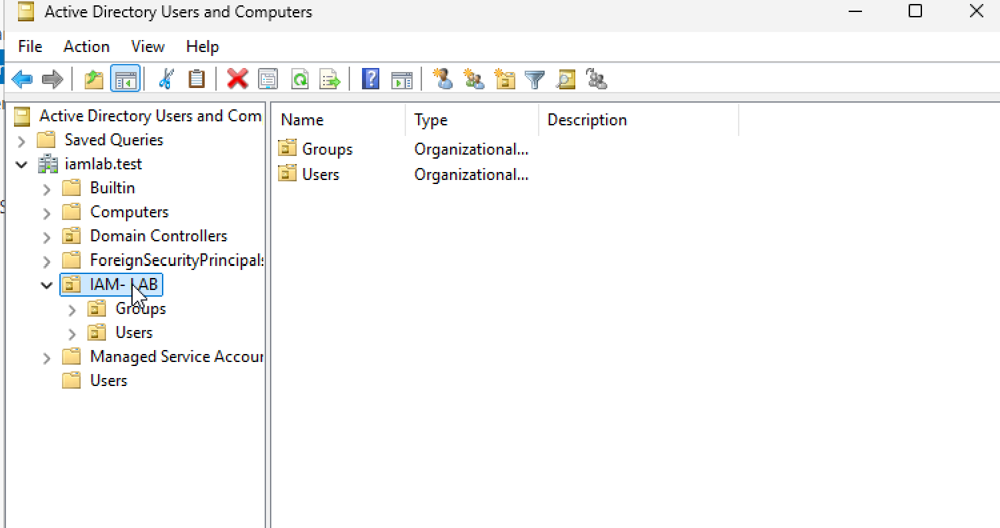

Windows Server + Active Directory Lab

## Project Overview
This project documents my hands-on Windows Server and Active Directory lab environment. The purpose of this lab is to build practical experience with Windows Server administration, Active Directory Domain Services, domain controller configuration, user and group management, networking, and troubleshooting.

## Lab Environment
- Windows Server
- Active Directory Domain Services (AD DS)
- Domain Controller: IAM-DC01
- Virtual Machine Environment
- Windows Administrative Tools

## Objectives
- Configure a Windows Server virtual machine
- Install Active Directory Domain Services
- Promote the server to a domain controller
- Create and manage users
- Create and manage groups
- Explore organizational and directory structure
- Verify domain services
- Troubleshoot connectivity and system issues

## Hands-On Activities
During this lab, I configured a Windows Server environment and used Active Directory to create and manage directory objects.

I worked with:
- Domain controller configuration
- Active Directory Users and Computers
- User accounts
- Security groups
- Directory administration
- Service verification
- Networking and system configuration

## Troubleshooting Experience
This lab included troubleshooting Windows Server and Active Directory issues, including service connectivity and system time synchronization.

I verified services, reviewed system settings, and corrected configuration issues to restore proper communication between systems.

## Skills Demonstrated
- Windows Server Administration
- Active Directory Domain Services
- Domain Controller Configuration
- User and Group Management
- Identity Administration
- Windows Services
- Networking Fundamentals
- Technical Troubleshooting

## Screenshots
Sanitized screenshots documenting the Windows Server and Active Directory configuration will be added to this repository.

> Security Note: Sensitive information such as passwords, private IP information, credentials, and personally identifiable information will not be included in this repository.
> 

### Active Directory OU Structure

This screenshot shows the custom IAM-LAB organizational unit structure created in Active Directory, including separate Users and Groups organizational units for identity administration.

## What I Learned
This lab strengthened my understanding of how Windows Server and Active Directory provide centralized identity and directory services. It also helped me develop practical troubleshooting skills and prepared the environment for integration with identity platforms such as Okta.

## Next Steps
I plan to continue expanding this lab with additional Active Directory administration, Group Policy, identity lifecycle management, access control, and security exercises.
